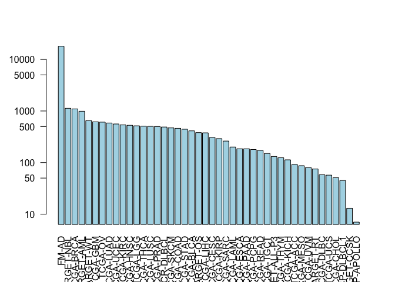

Class 18: Cancer Genomics
================

``` r
library(GenomicDataCommons)
```

    ## Loading required package: magrittr

    ## 
    ## Attaching package: 'GenomicDataCommons'

    ## The following object is masked from 'package:stats':
    ## 
    ##     filter

``` r
library(TCGAbiolinks)
library(maftools)
```

``` r
GenomicDataCommons::status()
```

    ## $commit
    ## [1] "e4b233ceb9a8183f93005e77f0754eae0418c073"
    ## 
    ## $data_release
    ## [1] "Data Release 15.0 - February 20, 2019"
    ## 
    ## $status
    ## [1] "OK"
    ## 
    ## $tag
    ## [1] "1.19.0"
    ## 
    ## $version
    ## [1] 1

``` r
cases_by_project <- cases() %>%
  facet("project.project_id") %>%
  aggregations()
head(cases_by_project)
```

    ## $project.project_id
    ##               key doc_count
    ## 1           FM-AD     18004
    ## 2      TARGET-NBL      1127
    ## 3       TCGA-BRCA      1098
    ## 4      TARGET-AML       988
    ## 5       TARGET-WT       652
    ## 6        TCGA-GBM       617
    ## 7         TCGA-OV       608
    ## 8       TCGA-LUAD       585
    ## 9       TCGA-UCEC       560
    ## 10      TCGA-KIRC       537
    ## 11      TCGA-HNSC       528
    ## 12       TCGA-LGG       516
    ## 13      TCGA-THCA       507
    ## 14      TCGA-LUSC       504
    ## 15      TCGA-PRAD       500
    ## 16   NCICCR-DLBCL       489
    ## 17      TCGA-SKCM       470
    ## 18      TCGA-COAD       461
    ## 19      TCGA-STAD       443
    ## 20      TCGA-BLCA       412
    ## 21      TARGET-OS       381
    ## 22      TCGA-LIHC       377
    ## 23      TCGA-CESC       307
    ## 24      TCGA-KIRP       291
    ## 25      TCGA-SARC       261
    ## 26      TCGA-LAML       200
    ## 27      TCGA-ESCA       185
    ## 28      TCGA-PAAD       185
    ## 29      TCGA-PCPG       179
    ## 30      TCGA-READ       172
    ## 31      TCGA-TGCT       150
    ## 32  TARGET-ALL-P3       131
    ## 33      TCGA-THYM       124
    ## 34      TCGA-KICH       113
    ## 35       TCGA-ACC        92
    ## 36      TCGA-MESO        87
    ## 37       TCGA-UVM        80
    ## 38      TARGET-RT        75
    ## 39      TCGA-DLBC        58
    ## 40       TCGA-UCS        57
    ## 41      TCGA-CHOL        51
    ## 42    CTSP-DLBCL1        45
    ## 43    TARGET-CCSK        13
    ## 44 VAREPOP-APOLLO         7

``` r
x <- cases_by_project$project.project_id
head(x)
```

    ##          key doc_count
    ## 1      FM-AD     18004
    ## 2 TARGET-NBL      1127
    ## 3  TCGA-BRCA      1098
    ## 4 TARGET-AML       988
    ## 5  TARGET-WT       652
    ## 6   TCGA-GBM       617

``` r
# Make a custom color vector for our plot
colvec <- rep("lightblue", nrow(x))
#colvec[___] <- "red"

# Plot with 'log' for y axis and rotate labels with 'las'
#par(___)  
barplot(x$doc_count, names.arg=x$key, log="y", col=colvec, las=2)
```



``` r
query <- GDCquery(project="TCGA-PAAD",
                  data.category="Transcriptome Profiling",
                  data.type="Gene Expression Quantification")
```

    ## --------------------------------------

    ## o GDCquery: Searching in GDC database

    ## --------------------------------------

    ## Genome of reference: hg38

    ## --------------------------------------------

    ## oo Accessing GDC. This might take a while...

    ## --------------------------------------------

    ## ooo Project: TCGA-PAAD

    ## --------------------

    ## oo Filtering results

    ## --------------------

    ## ooo By data.type

    ## ----------------

    ## oo Checking data

    ## ----------------

    ## ooo Check if there are duplicated cases

    ## Warning: There are more than one file for the same case. Please verify query results. You can use the command View(getResults(query)) in rstudio

    ## ooo Check if there results for the query

    ## -------------------

    ## o Preparing output

    ## -------------------

``` r
ans <- getResults(query)
```

``` r
View(ans)
nrow(ans)
```

    ## [1] 546

``` r
maf.file <- GDCquery_Maf(tumor="PAAD", pipelines = "mutect")
```

    ## ============================================================================

    ##  For more information about MAF data please read the following GDC manual and web pages:

    ##  GDC manual: https://gdc-docs.nci.nih.gov/Data/PDF/Data_UG.pdf

    ##  https://gdc-docs.nci.nih.gov/Data/Bioinformatics_Pipelines/DNA_Seq_Variant_Calling_Pipeline/

    ##  https://gdc.cancer.gov/about-gdc/variant-calling-gdc

    ## ============================================================================

    ## --------------------------------------

    ## o GDCquery: Searching in GDC database

    ## --------------------------------------

    ## Genome of reference: hg38

    ## --------------------------------------------

    ## oo Accessing GDC. This might take a while...

    ## --------------------------------------------

    ## ooo Project: TCGA-PAAD

    ## --------------------

    ## oo Filtering results

    ## --------------------

    ## ooo By access

    ## ooo By data.type

    ## ooo By workflow.type

    ## ----------------

    ## oo Checking data

    ## ----------------

    ## ooo Check if there are duplicated cases

    ## ooo Check if there results for the query

    ## -------------------

    ## o Preparing output

    ## -------------------

    ## Downloading data for project TCGA-PAAD

    ## Of the 1 files for download 1 already exist.

    ## All samples have been already downloaded

    ## 
    |=====                                                      |   9%    4 MB
    |======                                                     |  10%    4 MB
    |======                                                     |  10%    4 MB
    |======                                                     |  10%    4 MB
    |======                                                     |  10%    4 MB
    |======                                                     |  11%    4 MB
    |======                                                     |  11%    4 MB
    |=======                                                    |  11%    4 MB
    |=======                                                    |  12%    5 MB
    |=======                                                    |  12%    5 MB
    |=======                                                    |  12%    5 MB
    |=======                                                    |  12%    5 MB
    |=======                                                    |  13%    5 MB
    |========                                                   |  13%    5 MB
    |========                                                   |  13%    5 MB
    |========                                                   |  14%    5 MB
    |========                                                   |  14%    6 MB
    |========                                                   |  14%    6 MB
    |========                                                   |  14%    6 MB
    |=========                                                  |  15%    6 MB
    |=========                                                  |  15%    6 MB
    |=========                                                  |  15%    6 MB
    |=========                                                  |  16%    6 MB
    |=========                                                  |  16%    6 MB
    |=========                                                  |  16%    6 MB
    |==========                                                 |  16%    7 MB
    |==========                                                 |  17%    7 MB
    |==========                                                 |  17%    7 MB
    |==========                                                 |  17%    7 MB
    |==========                                                 |  17%    7 MB
    |==========                                                 |  18%    7 MB
    |===========                                                |  18%    7 MB
    |===========                                                |  18%    7 MB
    |===========                                                |  19%    8 MB
    |===========                                                |  19%    8 MB
    |===========                                                |  19%    8 MB
    |===========                                                |  19%    8 MB
    |============                                               |  20%    8 MB
    |============                                               |  20%    8 MB
    |============                                               |  20%    8 MB
    |============                                               |  20%    8 MB
    |============                                               |  21%    8 MB
    |============                                               |  21%    9 MB
    |=============                                              |  21%    9 MB
    |=============                                              |  21%    9 MB
    |=============                                              |  22%    9 MB
    |=============                                              |  22%    9 MB
    |=============                                              |  22%    9 MB
    |=============                                              |  23%    9 MB
    |=============                                              |  23%    9 MB
    |==============                                             |  23%    9 MB
    |==============                                             |  23%   10 MB
    |==============                                             |  24%   10 MB
    |==============                                             |  24%   10 MB
    |==============                                             |  24%   10 MB
    |==============                                             |  24%   10 MB
    |===============                                            |  25%   10 MB
    |===============                                            |  25%   10 MB
    |===============                                            |  25%   10 MB
    |===============                                            |  25%   10 MB
    |===============                                            |  26%   11 MB
    |===============                                            |  26%   11 MB
    |===============                                            |  26%   11 MB
    |================                                           |  26%   11 MB
    |================                                           |  27%   11 MB
    |================                                           |  27%   11 MB
    |================                                           |  27%   11 MB
    |================                                           |  28%   11 MB
    |=================                                          |  28%   11 MB
    |=================                                          |  28%   12 MB
    |=================                                          |  28%   12 MB
    |=================                                          |  29%   12 MB
    |=================                                          |  29%   12 MB
    |=================                                          |  29%   12 MB
    |==================                                         |  30%   12 MB
    |==================                                         |  30%   12 MB
    |==================                                         |  30%   12 MB
    |==================                                         |  30%   13 MB
    |==================                                         |  31%   13 MB
    |==================                                         |  31%   13 MB
    |===================                                        |  31%   13 MB
    |===================                                        |  32%   13 MB
    |===================                                        |  32%   13 MB
    |===================                                        |  32%   13 MB
    |===================                                        |  33%   13 MB
    |===================                                        |  33%   14 MB
    |====================                                       |  33%   14 MB
    |====================                                       |  33%   14 MB
    |====================                                       |  34%   14 MB
    |====================                                       |  34%   14 MB
    |====================                                       |  34%   14 MB
    |====================                                       |  34%   14 MB
    |=====================                                      |  35%   14 MB
    |=====================                                      |  35%   14 MB
    |=====================                                      |  35%   15 MB
    |=====================                                      |  36%   15 MB
    |=====================                                      |  36%   15 MB
    |=====================                                      |  36%   15 MB
    |======================                                     |  36%   15 MB
    |======================                                     |  37%   15 MB
    |======================                                     |  37%   15 MB
    |======================                                     |  37%   15 MB
    |======================                                     |  37%   15 MB
    |======================                                     |  38%   16 MB
    |=======================                                    |  38%   16 MB
    |=======================                                    |  38%   16 MB
    |=======================                                    |  38%   16 MB
    |=======================                                    |  39%   16 MB
    |=======================                                    |  39%   16 MB
    |=======================                                    |  39%   16 MB
    |=======================                                    |  39%   16 MB
    |========================                                   |  40%   16 MB
    |========================                                   |  40%   17 MB
    |========================                                   |  40%   17 MB
    |========================                                   |  41%   17 MB
    |========================                                   |  41%   17 MB
    |=========================                                  |  41%   17 MB
    |=========================                                  |  41%   17 MB
    |=========================                                  |  42%   17 MB
    |=========================                                  |  42%   17 MB
    |=========================                                  |  42%   18 MB
    |=========================                                  |  43%   18 MB
    |==========================                                 |  43%   18 MB
    |==========================                                 |  43%   18 MB
    |==========================                                 |  43%   18 MB
    |==========================                                 |  44%   18 MB
    |==========================                                 |  44%   18 MB
    |==========================                                 |  44%   18 MB
    |==========================                                 |  44%   18 MB
    |===========================                                |  45%   19 MB
    |===========================                                |  45%   19 MB
    |===========================                                |  45%   19 MB
    |===========================                                |  46%   19 MB
    |===========================                                |  46%   19 MB
    |===========================                                |  46%   19 MB
    |============================                               |  46%   19 MB
    |============================                               |  47%   19 MB
    |============================                               |  47%   19 MB
    |============================                               |  47%   20 MB
    |============================                               |  47%   20 MB
    |============================                               |  48%   20 MB
    |=============================                              |  48%   20 MB
    |=============================                              |  48%   20 MB
    |=============================                              |  49%   20 MB
    |=============================                              |  49%   20 MB
    |=============================                              |  49%   20 MB
    |=============================                              |  49%   20 MB
    |==============================                             |  50%   21 MB
    |==============================                             |  50%   21 MB
    |==============================                             |  50%   21 MB
    |==============================                             |  50%   21 MB
    |==============================                             |  51%   21 MB
    |==============================                             |  51%   21 MB
    |===============================                            |  51%   21 MB
    |===============================                            |  51%   21 MB
    |===============================                            |  52%   21 MB
    |===============================                            |  52%   22 MB
    |===============================                            |  52%   22 MB
    |===============================                            |  53%   22 MB
    |===============================                            |  53%   22 MB
    |================================                           |  53%   22 MB
    |================================                           |  53%   22 MB
    |================================                           |  54%   22 MB
    |================================                           |  54%   22 MB
    |================================                           |  54%   22 MB
    |================================                           |  54%   23 MB
    |=================================                          |  55%   23 MB
    |=================================                          |  55%   23 MB
    |=================================                          |  55%   23 MB
    |=================================                          |  55%   23 MB
    |=================================                          |  56%   23 MB
    |=================================                          |  56%   23 MB
    |==================================                         |  56%   23 MB
    |==================================                         |  56%   23 MB
    |==================================                         |  57%   24 MB
    |==================================                         |  57%   24 MB
    |==================================                         |  57%   24 MB
    |==================================                         |  58%   24 MB
    |===================================                        |  58%   24 MB
    |===================================                        |  58%   24 MB
    |===================================                        |  59%   24 MB
    |===================================                        |  59%   24 MB
    |===================================                        |  59%   25 MB
    |===================================                        |  59%   25 MB
    |====================================                       |  60%   25 MB
    |====================================                       |  60%   25 MB
    |====================================                       |  60%   25 MB
    |====================================                       |  61%   25 MB
    |====================================                       |  61%   25 MB
    |====================================                       |  61%   25 MB
    |=====================================                      |  61%   26 MB
    |=====================================                      |  62%   26 MB
    |=====================================                      |  62%   26 MB
    |=====================================                      |  62%   26 MB
    |=====================================                      |  63%   26 MB
    |======================================                     |  63%   26 MB
    |======================================                     |  63%   26 MB
    |======================================                     |  63%   26 MB
    |======================================                     |  64%   26 MB
    |======================================                     |  64%   27 MB
    |======================================                     |  64%   27 MB
    |======================================                     |  64%   27 MB
    |=======================================                    |  65%   27 MB
    |=======================================                    |  65%   27 MB
    |=======================================                    |  65%   27 MB
    |=======================================                    |  66%   27 MB
    |=======================================                    |  66%   27 MB
    |=======================================                    |  66%   27 MB
    |========================================                   |  66%   28 MB
    |========================================                   |  67%   28 MB
    |========================================                   |  67%   28 MB
    |========================================                   |  67%   28 MB
    |========================================                   |  67%   28 MB
    |========================================                   |  68%   28 MB
    |=========================================                  |  68%   28 MB
    |=========================================                  |  68%   28 MB
    |=========================================                  |  69%   29 MB
    |=========================================                  |  69%   29 MB
    |=========================================                  |  69%   29 MB
    |==========================================                 |  70%   29 MB
    |==========================================                 |  70%   29 MB
    |==========================================                 |  70%   29 MB
    |==========================================                 |  70%   29 MB
    |==========================================                 |  71%   29 MB
    |==========================================                 |  71%   30 MB
    |===========================================                |  71%   30 MB
    |===========================================                |  72%   30 MB
    |===========================================                |  72%   30 MB
    |===========================================                |  72%   30 MB
    |===========================================                |  73%   30 MB
    |============================================               |  73%   30 MB
    |============================================               |  73%   31 MB
    |============================================               |  74%   31 MB
    |============================================               |  74%   31 MB
    |============================================               |  74%   31 MB
    |============================================               |  74%   31 MB
    |=============================================              |  75%   31 MB
    |=============================================              |  75%   31 MB
    |=============================================              |  75%   31 MB
    |=============================================              |  76%   32 MB
    |=============================================              |  76%   32 MB
    |==============================================             |  76%   32 MB
    |==============================================             |  77%   32 MB
    |==============================================             |  77%   32 MB
    |==============================================             |  77%   32 MB
    |==============================================             |  77%   32 MB
    |==============================================             |  78%   32 MB
    |===============================================            |  78%   33 MB
    |===============================================            |  78%   33 MB
    |===============================================            |  79%   33 MB
    |===============================================            |  79%   33 MB
    |===============================================            |  79%   33 MB
    |================================================           |  80%   33 MB
    |================================================           |  80%   33 MB
    |================================================           |  80%   33 MB
    |================================================           |  80%   33 MB
    |================================================           |  81%   34 MB
    |================================================           |  81%   34 MB
    |=================================================          |  81%   34 MB
    |=================================================          |  82%   34 MB
    |=================================================          |  82%   34 MB
    |=================================================          |  82%   34 MB
    |=================================================          |  82%   34 MB
    |=================================================          |  83%   34 MB
    |==================================================         |  83%   35 MB
    |==================================================         |  83%   35 MB
    |==================================================         |  84%   35 MB
    |==================================================         |  84%   35 MB
    |==================================================         |  84%   35 MB
    |==================================================         |  84%   35 MB
    |===================================================        |  85%   35 MB
    |===================================================        |  85%   35 MB
    |===================================================        |  85%   36 MB
    |===================================================        |  85%   36 MB
    |===================================================        |  86%   36 MB
    |===================================================        |  86%   36 MB
    |====================================================       |  86%   36 MB
    |====================================================       |  87%   36 MB
    |====================================================       |  87%   36 MB
    |====================================================       |  87%   36 MB
    |====================================================       |  87%   36 MB
    |====================================================       |  88%   37 MB
    |====================================================       |  88%   37 MB
    |=====================================================      |  88%   37 MB
    |=====================================================      |  88%   37 MB
    |=====================================================      |  89%   37 MB
    |=====================================================      |  89%   37 MB
    |=====================================================      |  89%   37 MB
    |=====================================================      |  89%   37 MB
    |======================================================     |  90%   37 MB
    |======================================================     |  90%   38 MB
    |======================================================     |  90%   38 MB
    |======================================================     |  91%   38 MB
    |======================================================     |  91%   38 MB
    |======================================================     |  91%   38 MB
    |=======================================================    |  91%   38 MB
    |=======================================================    |  92%   38 MB
    |=======================================================    |  92%   38 MB
    |=======================================================    |  92%   38 MB
    |=======================================================    |  92%   39 MB
    |=======================================================    |  93%   39 MB
    |========================================================   |  93%   39 MB
    |========================================================   |  93%   39 MB
    |========================================================   |  94%   39 MB
    |========================================================   |  94%   39 MB
    |========================================================   |  94%   39 MB
    |========================================================   |  94%   39 MB
    |=========================================================  |  95%   40 MB
    |=========================================================  |  95%   40 MB
    |=========================================================  |  95%   40 MB
    |=========================================================  |  96%   40 MB
    |=========================================================  |  96%   40 MB
    |=========================================================  |  96%   40 MB
    |========================================================== |  96%   40 MB
    |========================================================== |  97%   40 MB
    |========================================================== |  97%   40 MB
    |========================================================== |  97%   41 MB
    |========================================================== |  97%   41 MB
    |========================================================== |  98%   41 MB
    |===========================================================|  98%   41 MB
    |===========================================================|  98%   41 MB
    |===========================================================|  99%   41 MB
    |===========================================================|  99%   41 MB
    |===========================================================|  99%   41 MB
    |===========================================================|  99%   41 MB
    |============================================================| 100%   42 MB

``` r
head(maf.file)
```

    ## # A tibble: 6 x 120
    ##   Hugo_Symbol Entrez_Gene_Id Center NCBI_Build Chromosome Start_Position
    ##   <chr>                <int> <chr>  <chr>      <chr>               <int>
    ## 1 BCAN                 63827 BI     GRCh38     chr1            156651635
    ## 2 TNN                  63923 BI     GRCh38     chr1            175135891
    ## 3 PM20D1              148811 BI     GRCh38     chr1            205850012
    ## 4 CR1                   1378 BI     GRCh38     chr1            207523807
    ## 5 MLK4                 84451 BI     GRCh38     chr1            233372058
    ## 6 ITSN2                50618 BI     GRCh38     chr2             24310368
    ## # … with 114 more variables: End_Position <int>, Strand <chr>,
    ## #   Variant_Classification <chr>, Variant_Type <chr>,
    ## #   Reference_Allele <chr>, Tumor_Seq_Allele1 <chr>,
    ## #   Tumor_Seq_Allele2 <chr>, dbSNP_RS <chr>, dbSNP_Val_Status <chr>,
    ## #   Tumor_Sample_Barcode <chr>, Matched_Norm_Sample_Barcode <chr>,
    ## #   Match_Norm_Seq_Allele1 <lgl>, Match_Norm_Seq_Allele2 <lgl>,
    ## #   Tumor_Validation_Allele1 <chr>, Tumor_Validation_Allele2 <chr>,
    ## #   Match_Norm_Validation_Allele1 <lgl>,
    ## #   Match_Norm_Validation_Allele2 <lgl>, Verification_Status <lgl>,
    ## #   Validation_Status <lgl>, Mutation_Status <chr>,
    ## #   Sequencing_Phase <lgl>, Sequence_Source <lgl>,
    ## #   Validation_Method <chr>, Score <lgl>, BAM_File <lgl>, Sequencer <chr>,
    ## #   Tumor_Sample_UUID <chr>, Matched_Norm_Sample_UUID <chr>, HGVSc <chr>,
    ## #   HGVSp <chr>, HGVSp_Short <chr>, Transcript_ID <chr>,
    ## #   Exon_Number <chr>, t_depth <int>, t_ref_count <int>,
    ## #   t_alt_count <int>, n_depth <int>, n_ref_count <lgl>,
    ## #   n_alt_count <lgl>, all_effects <chr>, Allele <chr>, Gene <chr>,
    ## #   Feature <chr>, Feature_type <chr>, One_Consequence <chr>,
    ## #   Consequence <chr>, cDNA_position <chr>, CDS_position <chr>,
    ## #   Protein_position <chr>, Amino_acids <chr>, Codons <chr>,
    ## #   Existing_variation <chr>, ALLELE_NUM <int>, DISTANCE <dbl>,
    ## #   TRANSCRIPT_STRAND <int>, SYMBOL <chr>, SYMBOL_SOURCE <chr>,
    ## #   HGNC_ID <chr>, BIOTYPE <chr>, CANONICAL <chr>, CCDS <chr>, ENSP <chr>,
    ## #   SWISSPROT <chr>, TREMBL <chr>, UNIPARC <chr>, RefSeq <chr>,
    ## #   SIFT <chr>, PolyPhen <chr>, EXON <chr>, INTRON <chr>, DOMAINS <chr>,
    ## #   GMAF <dbl>, AFR_MAF <dbl>, AMR_MAF <dbl>, ASN_MAF <lgl>,
    ## #   EAS_MAF <dbl>, EUR_MAF <dbl>, SAS_MAF <dbl>, AA_MAF <dbl>,
    ## #   EA_MAF <dbl>, CLIN_SIG <chr>, SOMATIC <dbl>, PUBMED <chr>,
    ## #   MOTIF_NAME <lgl>, MOTIF_POS <lgl>, HIGH_INF_POS <lgl>,
    ## #   MOTIF_SCORE_CHANGE <lgl>, IMPACT <chr>, PICK <int>,
    ## #   VARIANT_CLASS <chr>, TSL <int>, HGVS_OFFSET <int>, PHENO <chr>,
    ## #   MINIMISED <int>, ExAC_AF <dbl>, ExAC_AF_Adj <dbl>, ExAC_AF_AFR <dbl>,
    ## #   ExAC_AF_AMR <dbl>, ExAC_AF_EAS <dbl>, ExAC_AF_FIN <dbl>, …

``` r
vars = read.maf(maf = maf.file, verbose = FALSE)
plotmafSummary(vars)
```


Oncostrip
---------

``` r
oncostrip(maf=vars, genes=c("KRAS", "TP53"))
```


Lollipop
--------

``` r
lollipopPlot(vars, gene='TP53')
```

    ## Assuming protein change information are stored under column HGVSp_Short. Use argument AACol to override if necessary.

    ## 8 transcripts available. Use arguments refSeqID or proteinID to manually specify tx name.

    ##    HGNC    refseq.ID   protein.ID aa.length
    ## 1: TP53    NM_000546    NP_000537       393
    ## 2: TP53 NM_001126112 NP_001119584       393
    ## 3: TP53 NM_001126118 NP_001119590       354
    ## 4: TP53 NM_001126115 NP_001119587       261
    ## 5: TP53 NM_001126113 NP_001119585       346
    ## 6: TP53 NM_001126117 NP_001119589       214
    ## 7: TP53 NM_001126114 NP_001119586       341
    ## 8: TP53 NM_001126116 NP_001119588       209

    ## Using longer transcript NM_000546 for now.


Part 2
------

``` r
library(bio3d)
seqs<- read.fasta("lecture18_sequences.fa")
seqs
```

    ##              1        .         .         .         .         .         60 
    ## P53_wt       MEEPQSDPSVEPPLSQETFSDLWKLLPENNVLSPLPSQAMDDLMLSPDDIEQWFTEDPGP
    ## P53_mutant   MEEPQSDPSVEPPLSQETFSDLWKLLPENNVLSPLPSQAMLDLMLSPDDIEQWFTEDPGP
    ##              **************************************** ******************* 
    ##              1        .         .         .         .         .         60 
    ## 
    ##             61        .         .         .         .         .         120 
    ## P53_wt       DEAPRMPEAAPPVAPAPAAPTPAAPAPAPSWPLSSSVPSQKTYQGSYGFRLGFLHSGTAK
    ## P53_mutant   DEAPWMPEAAPPVAPAPAAPTPAAPAPAPSWPLSSSVPSQKTYQGSYGFRLGFLHSGTAK
    ##              **** ******************************************************* 
    ##             61        .         .         .         .         .         120 
    ## 
    ##            121        .         .         .         .         .         180 
    ## P53_wt       SVTCTYSPALNKMFCQLAKTCPVQLWVDSTPPPGTRVRAMAIYKQSQHMTEVVRRCPHHE
    ## P53_mutant   SVTCTYSPALNKMFCQLAKTCPVQLWVDSTPPPGTRVRAMAIYKQSQHMTEVVRRCPHHE
    ##              ************************************************************ 
    ##            121        .         .         .         .         .         180 
    ## 
    ##            181        .         .         .         .         .         240 
    ## P53_wt       RCSDSDGLAPPQHLIRVEGNLRVEYLDDRNTFRHSVVVPYEPPEVGSDCTTIHYNYMCNS
    ## P53_mutant   RCSDSDGLAPPQHLIRVEGNLRVEYLDDRNTFVHSVVVPYEPPEVGSDCTTIHYNYMCNS
    ##              ******************************** *************************** 
    ##            181        .         .         .         .         .         240 
    ## 
    ##            241        .         .         .         .         .         300 
    ## P53_wt       SCMGGMNRRPILTIITLEDSSGNLLGRNSFEVRVCACPGRDRRTEEENLRKKGEPHHELP
    ## P53_mutant   SCMGGMNRRPILTIITLEV-----------------------------------------
    ##              ******************                                           
    ##            241        .         .         .         .         .         300 
    ## 
    ##            301        .         .         .         .         .         360 
    ## P53_wt       PGSTKRALPNNTSSSPQPKKKPLDGEYFTLQIRGRERFEMFRELNEALELKDAQAGKEPG
    ## P53_mutant   ------------------------------------------------------------
    ##                                                                           
    ##            301        .         .         .         .         .         360 
    ## 
    ##            361        .         .         .  393 
    ## P53_wt       GSRAHSSHLKSKKGQSTSRHKKLMFKTEGPDSD
    ## P53_mutant   ---------------------------------
    ##                                                
    ##            361        .         .         .  393 
    ## 
    ## Call:
    ##   read.fasta(file = "lecture18_sequences.fa")
    ## 
    ## Class:
    ##   fasta
    ## 
    ## Alignment dimensions:
    ##   2 sequence rows; 393 position columns (259 non-gap, 134 gap) 
    ## 
    ## + attr: id, ali, call

``` r
## Calculate positional identity scores
ide <- conserv(seqs$ali, method="identity")
mutant.sites <- which(ide < 1) 

## Exclude gap possitions from analysis
gaps <- gap.inspect(seqs)
mutant.sites <- mutant.sites[mutant.sites %in% gaps$f.inds]

mutant.sites
```

    ## [1]  41  65 213 259

``` r
## Make a "names" label for our output sequences (one per mutant)
mutant.names <- paste0(seqs$ali["P53_wt",mutant.sites],
                       mutant.sites,
                       seqs$ali["P53_mutant",mutant.sites])

mutant.names
```

    ## [1] "D41L"  "R65W"  "R213V" "D259V"

``` r
## Sequence positions surounding each mutant site
start.position <- mutant.sites - 8
end.position <-  mutant.sites + 8

# Blank matrix to store sub-sequences
store.seqs <- matrix("-", nrow=length(mutant.sites), ncol=17)
rownames(store.seqs) <- mutant.names

## Extract each sub-sequence
for(i in 1:length(mutant.sites)) {
  store.seqs[i,] <- seqs$ali["P53_mutant",start.position[i]:end.position[i]]
}

store.seqs
```

    ##       [,1] [,2] [,3] [,4] [,5] [,6] [,7] [,8] [,9] [,10] [,11] [,12] [,13]
    ## D41L  "S"  "P"  "L"  "P"  "S"  "Q"  "A"  "M"  "L"  "D"   "L"   "M"   "L"  
    ## R65W  "D"  "P"  "G"  "P"  "D"  "E"  "A"  "P"  "W"  "M"   "P"   "E"   "A"  
    ## R213V "Y"  "L"  "D"  "D"  "R"  "N"  "T"  "F"  "V"  "H"   "S"   "V"   "V"  
    ## D259V "I"  "L"  "T"  "I"  "I"  "T"  "L"  "E"  "V"  "-"   "-"   "-"   "-"  
    ##       [,14] [,15] [,16] [,17]
    ## D41L  "S"   "P"   "D"   "D"  
    ## R65W  "A"   "P"   "P"   "V"  
    ## R213V "V"   "P"   "Y"   "E"  
    ## D259V "-"   "-"   "-"   "-"

``` r
## Output a FASTA file for further analysis
write.fasta(seqs=store.seqs, ids=mutant.names, file="subsequences.fa")
```
