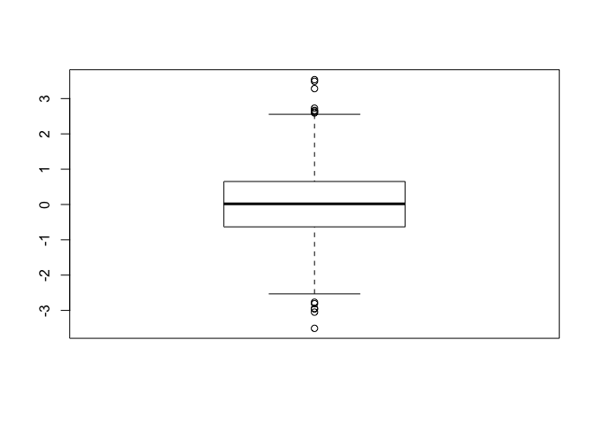
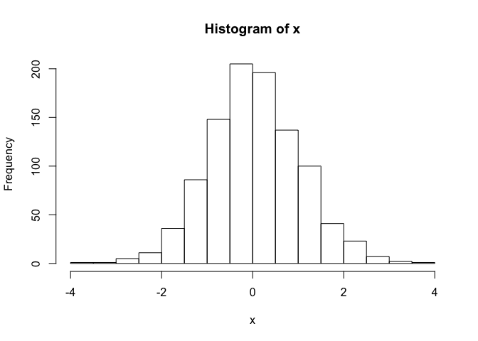
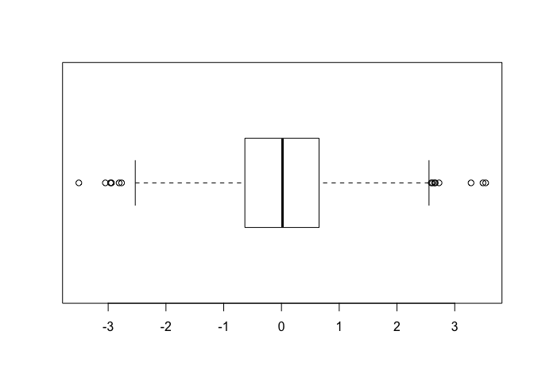
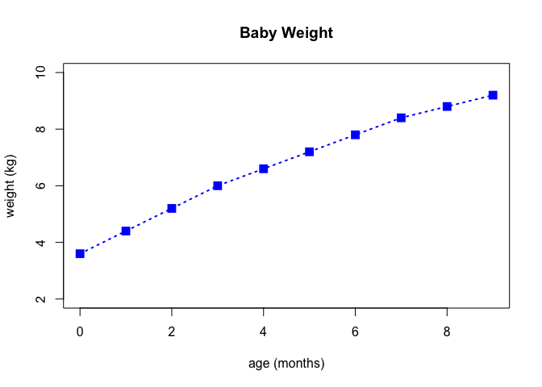
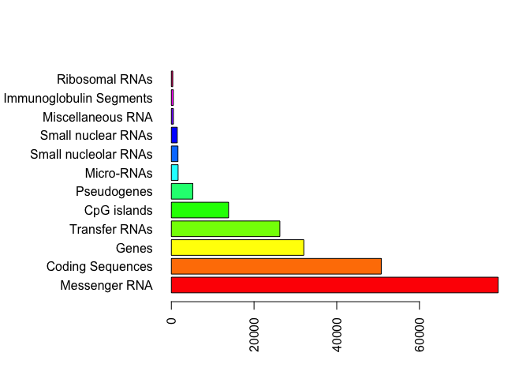
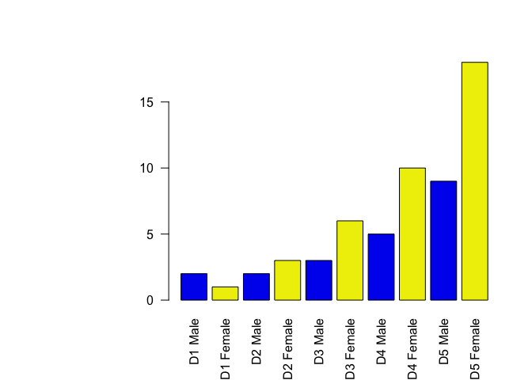
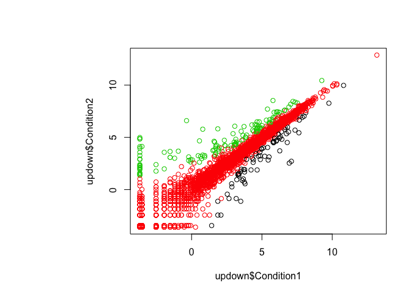

Class 5 Introduction to R graphics
================
Amber Fossier
Jan 22, 2019

``` r
#Class 05 R graphics intro

#My first boxplot
x<-rnorm(1000,0)
boxplot( x)
```



``` r
summary(x)
```

    ##     Min.  1st Qu.   Median     Mean  3rd Qu.     Max. 
    ## -3.50816 -0.63285  0.01828  0.04574  0.64987  3.53590

``` r
hist(x)
```



``` r
boxplot(x, horizontal= TRUE)
```



``` r
weight<-read.table("bimm143_05_rstats/weight_chart.txt", 
                   header =TRUE, sep = "")
plot(weight$Age, weight$Weight, typ="o", 
     pch=15, cex=1.5, lwd=2, ylim=c(2,10), 
     xlab="age (months)", ylab="weight (kg)", 
     main="Baby Weight", col="blue", lty=3)
```



``` r
mouse <- read.table("bimm143_05_rstats/feature_counts.txt", 
                    header = TRUE, sep = "\t")
barplot(mouse$Count, horiz=TRUE, names.arg= mouse$Feature, 
        las=2)

#change margin so we can see the labels
par(mar=c(5.1,11.1,4.1,2.1))
barplot(mouse$Count, horiz=TRUE, names.arg= mouse$Feature, 
        las=2)
```


``` r
#add color
barplot(mouse$Count, horiz=TRUE, names.arg= mouse$Feature, 
        las=2, col=rainbow(nrow(mouse)))
```



``` r
#male/female
mf <- read.table("bimm143_05_rstats/male_female_counts.txt", 
                    header = TRUE, sep = "\t")
barplot(mf$Count, horiz=FALSE, names.arg= mf$Sample, 
        las=2, col=c("blue2", "yellow2"))
```



``` r
#updown
updown <- read.delim("bimm143_05_rstats/up_down_expression.txt", 
                 header = TRUE, sep = "")
#plot(updown)
plot(updown$Condition1, updown$Condition2, col=updown$State)
```



``` r
#table(updown$State)
palette(c("red", "grey", "blue"))

e <- read.table("bimm143_05_rstats/up_down_expression.txt", header=TRUE)
nrow(e)
```

    ## [1] 5196

``` r
table(e$State)
```

    ## 
    ##       down unchanging         up 
    ##         72       4997        127
